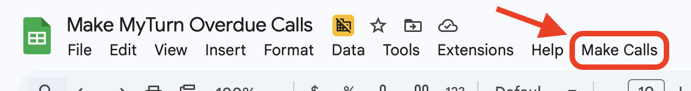

# Make MyTurn Overdue Calls

## Overview

This is a Google Apps Script project that (when combined with its Google Sheet) helps your tool library staff identify and make phone calls to [MyTurn](https://myturn.com) patrons with long-overdue items. This both encourages returns, and (if the items are not returned within a set period of time) prompts you to update your tool library's MyTurn inventory to reflect that those tools are permanently lost.

### Benefits

- Having more accurate information on which items likely won't ever be returned helps your tool library purchase/solicit more of those items (if needed)
- Likewise, having more accurate information helps patrons too: they won't have to wonder as much whether that "overdue" item they're waiting on is actually going to come back
- Being prompted to set warnings on delinquent patrons' accounts enables your tool library to prevent them from abusing checkouts in the future, until the original items are returned

### What the Google Sheet and this Apps Script project enable

- They automatically pull overdue item data from your tool library's MyTurn on a daily basis
- They identify patrons who have inventory checked out that is long-overdue, and who haven't already been phoned recently
- They provide a [custom menu](https://developers.google.com/apps-script/guides/menus) in the Google Sheets menu bar. When clicked, a modal will pop up with information to call a patron, and a suggested script for if the call goes to voicemail.
- If a patron has been phoned multiple times already and we've waited a week, then the Google Sheet identifies them so that tool library staff can `disable` their items and add a warning note to their MyTurn user

## Initial, one-time configuration

### Configuration within the Google Sheet

#### `Configuration` sheet

Your Google Sheet has a `Configuration` sheet with cells that you can edit to identify your tool library and change some parameters of how the system works.

> [!NOTE]
> You should only ever edit the cells in the second column of the `Configuration` sheet (ie, the configuration _values_). You can also change these values whenever you'd like; for example, your tool library's opening hours might change in the future, or you might decide on a different policy about how long to wait between calls to patrons.

| Configuration field              | Details                                                                                                                                                                                                                                                                                                                                                                                                                                  |
| -------------------------------- | ---------------------------------------------------------------------------------------------------------------------------------------------------------------------------------------------------------------------------------------------------------------------------------------------------------------------------------------------------------------------------------------------------------------------------------------- |
| `MyTurn Subdomain`               | This is the text _after_ `https://` and _before_ `.myturn.com` in your tool library's MyTurn URL. For example, for `https://capitolhill.myturn.com/library/` the value would be `capitolhill`.                                                                                                                                                                                                                                           |
| `Tool Library Name`              | This is your tool library's name. For example, `Capitol Hill Tool Library`.                                                                                                                                                                                                                                                                                                                                                              |
| `Open Hours Text`                | What hours your tool library is open. This text will appear in the suggested voicemail script. For example, you might say `Tuesdays 4 PM to 9 PM and weekends 10 AM to noon`.                                                                                                                                                                                                                                                            |
| `Days Overdue Before First Call` | The number of days to wait _after_ a patron's items become overdue before making them eligible to be phoned. (It's recommended that you set up [overdue reminder emails within your MyTurn](https://support.myturn.com/hc/en-us/articles/214580817-Automated-Email-Reminders) so that patrons with overdue items will have received multiple emails _before_ they get their first phone call!) The default value for this field is `60`. |
| `Maximum Phone Calls`            | The number of phone calls to make before "giving up on" a patron and assuming that they probably won't return their items. The default value for this field is `2`.                                                                                                                                                                                                                                                                      |
| `Minimum Days Between Calls`     | The number of days to wait _after_ a phone call before that patron is eligible to be called again; alternatively, if the patron has already received `Maximum Phone Calls` then the number of days to wait before marking them as delinquent and unlikely to ever return the items (ie, marking `Should Mark Items as Disabled?` as `TRUE` in the `Users with Overdue Items` sheet). The default value for this field is `14`.           |

#### `Configuration: MyTurn High-Value Item Taxonomies` sheet

> [!NOTE]
> Populating this sheet's values is _optional_; it is fine to leave it blank.

You can use this sheet to limit which categories of items are eligible for patrons to get phoned about.

Sometimes a patron may have long-overdue items, but these items are of low financial value (and your tool library has many copies of that item). For example, if a patron just has a hand saw and a paintbrush checked out, you may decide it's not ever worth phoning them. This `Configuration: MyTurn High-Value Item Taxonomies` sheet solves that issue.

To populate this configuration sheet, identify which `Type`s of MyTurn items in your tool library's inventory _are_ worth phoning patrons about, and put those types into cells in the first column (column `A`) of the sheet.

You can see the tree of all MyTurn item types by clicking on `Add Item` in your MyTurn's admin panel. The types are nested within each other: for instance, the `Power Tools` item type is a subset of the `Tools` item type, and `Jointers` is a subset of `Corded & Plug-in`; if you'd like to include all patrons with an overdue power tool in your phone calls, then put `Power Tools` into one of the column `A` cells in your `Configuration: MyTurn High-Value Item Taxonomies` sheet.

You may populate item type names in as many cells in this sheet as you would like. Conversely, if all this sheet's cells are blank/empty, then _all_ items will be eligible for overdue phone calls.

### Configuration within the sheet's Apps Script interface

_TODO_

## How to use

> [!NOTE]
> This Google Sheet includes functionality from a Google Apps Script, and therefore you can only use this document on a computer, not on a smartphone.

- Click on the custom menu `Make Calls` -> `Initiate call`
  - The first time you click this, you will be asked to allow permissions for this document's Apps Script. Approve this request.
- `Make Calls` -> `Initiate call` will open a dialog box with information on a specific patron to phone, their overdue items, a suggested voicemail script in case they don't pick up, and a form to record the outcome of your call
  - If you'd like to avoid patrons having your personal phone number, consider placing calls using your tool library's phone or VoIP line, if possible
- Once you complete the call, fill out that form and click `Submit`. The dialog box will close, and you can start another call.

Every week or two, someone at your tool library should review the `Should Mark Items as Disabled?` column in the `Users with Overdue Items` sheet. If that column shows `TRUE` for a user then they have been unresponsive to calls and are unlikely to ever return those items, and you should update their items' [MyTurn statuses](https://support.myturn.com/hc/en-us/articles/206388187-Item-Statuses-e-g-On-Site-Use-Only-Sold-For-Sale-etc) to `Disabled` (or a similar, custom status that you've created to track these items, like `Never Returned`).

> [!NOTE]
> If this Google Sheet isn't functioning correctly, invite miles@sustainablecapitolhill.org as an editor and email him with specific details describing your problem.

## Contributing code

Install and use [`clasp`](https://github.com/google/clasp) on your command line to deploy changes that you make to the Apps Script. You should _not_ make edits to the Apps Script in the browser, only via `clasp`.

You'll need to `clasp login` and then `clasp clone` the already-deployed Apps Script in order to get started. This will create a (`.gitignore`'d) `.clasp.json` file that holds the script's deployed location and ID.

`clasp push` will immediately deploy any changes to the Google Sheets documents that use it. Typically, you don't even need to refresh the Google Sheets's browser window before you see the results of your code changes.

## Changelog

- February _TODO_, 2026: Initial public release
